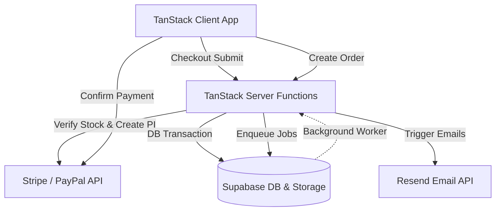

# Project Overview — ANORA Elegance Atelier

ANORA is a premium luxury fashion brand and haute couture digital atelier. The application is built as an ultra-premium, high-performance, mobile-responsive e-commerce platform offering tailored apparel and boutique jewellery with secure checkout, automated order processing pipelines, and guest/authenticated order tracking.

## Technology Stack

- **Frontend Core**: React 18 with TypeScript.
- **Routing & SSR**: TanStack Start + TanStack Router (providing hybrid Server-Side Rendering and Client-Side Navigation).
- **Styling**: Tailwind CSS (integrated with Vite for maximum visual control and custom CSS tokens).
- **Backend & Database**: Supabase (PostgreSQL database, Row Level Security, Storage buckets for static assets and PDFs, Realtime database updates, and Database Functions/RPCs).
- **Payment Processing**: Stripe (Embedded Elements checkout) and PayPal (Sandbox/Production React SDK integration).
- **Transactional Emails**: Resend API integration.
- **Invoice Processing**: Inline PDF generation using `jsPDF` with automatic upload/signed-url retrieval from Supabase Storage.
- **Job Queue Pipeline**: Background Queue Service with single worker concurrency, atomic database claiming, and automatic verification/job logging.

## Major Features

- **Dynamic Shop Directory**: Interactive catalogs for Clothing (pret, luxury pret, formal/casual wear) and Jewellery (rings, earrings, bracelets, necklaces) with category filters, dynamic slug routing, and availability indicators.
- **Dynamic Size/Color Variant Selection**: Supports distinct product attributes, overrides, and live stock checking.
- **Guest Checkout & Order Flow**: Dynamic cart caching synchronized with client databases. Guest buyers can checkout securely with Stripe/PayPal and track their orders using unique uppercase alphanumeric Tracking IDs without logging in.
- **Automated Backend Pipeline**: Serial job processing for invoices, thank-you emails, admin alerts, analytics tracking, and final application log auditing.
- **Admin Dashboard**: Comprehensive order status management (confirmed, packed, out for delivery, shipped, delivered, cancelled), inventory counts, customer registries, and refund requests.

## Architecture

### Current Status
- **Current Completion Percentage**: 95%+
- **Build / Compiler Verification**: Checked and compiling with zero errors.
- **Deployment Platform**: Vercel Serverless Functions (Backend) + Vercel Edge Network (Frontend static assets).
- **Conventions**: No module-level state initialization during imports (uses Dependency Injection container `ServerContainer`), strict structured JSON logging, typed error handling hierarchy, and strict Supabase schema path qualifiers.
