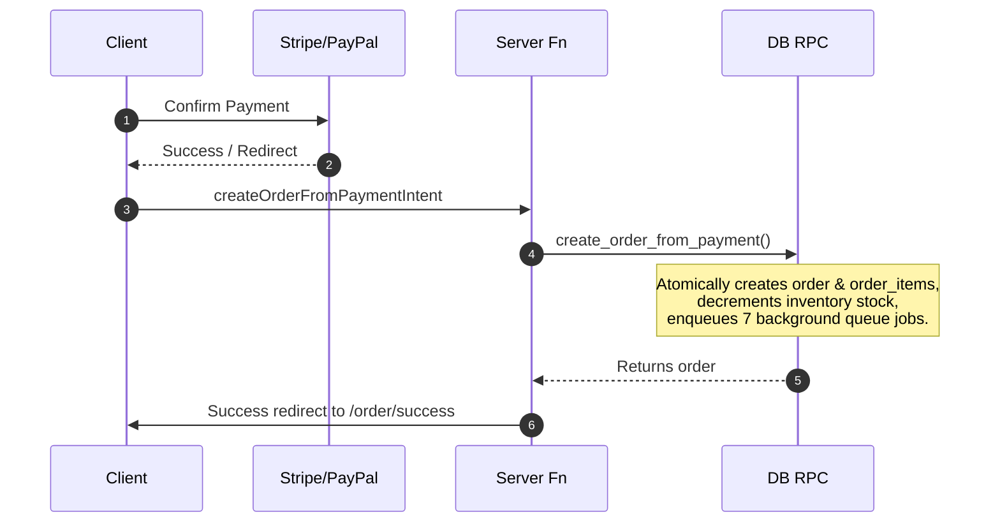

# Order Lifecycle & Pipelines

This document provides an end-to-end trace of the complete order creation and processing pipeline.

## 1. Product Selection & Cart
- The customer browses the catalog, selects options (e.g. sizes and colors), and adds items to their bag.
- The cart validates stock configurations and updates subtotal sums dynamically.

## 2. Checkout & Payment Initialization
- On submission of checkout forms, the client triggers the Payment Intent API (`createPaymentIntent` server function).
- Cart items are verified, and a Stripe PaymentIntent (or PayPal Checkout session) is registered on the respective gateway. An idempotency key prevents duplicate transaction registrations.
- Temporary inventory reservations (`inventory_reservations`) are written to prevent another guest from purchasing those items while payment is processing.

## 3. Order Processing Flow

## 4. Background Queue Pipeline
The database transaction enqueues 7 jobs into `background_jobs` for the order. The background worker claims and processes these serial queue tasks:
1. `generate_invoice`: Confirms order invoice creation status.
2. `generate_invoice_pdf`: Fired on worker, generates the invoice PDF binary via `jsPDF`, uploads it to Supabase Storage, and saves the file reference.
3. `send_thank_you_email`: Dispatches order confirmation email to the buyer via Resend.
4. `send_invoice_email`: Sends the invoice email with the PDF document attached.
5. `send_admin_email`: Sends administrative order alerts.
6. `analytics_events`: Logs purchase event records in DB metrics tables.
7. `application_logs`: Appends final audit trace marks to audit log databases.

## 5. Order Management & Status Transitions
- The admin dashboard permits updating the order state history.
- Supported statuses are: `pending` -> `confirmed` -> `packed` -> `out_for_delivery` -> `shipped` -> `delivered`.
- Cancellation (`cancel_order` RPC) releases item configurations back into stock.
- Return/Refund requests (`request_refund` RPC) record issues and track processing statuses.
